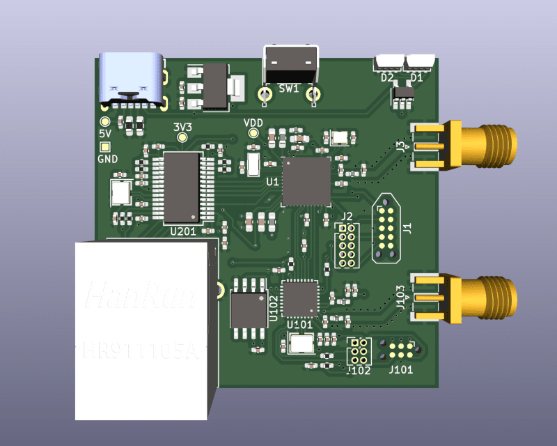
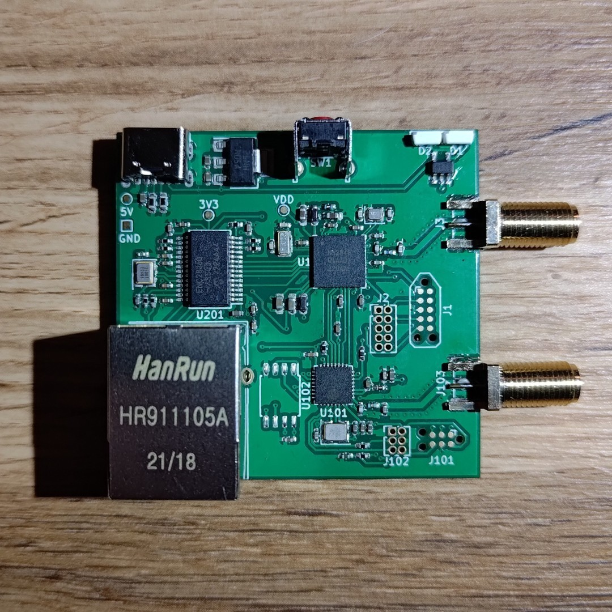

# HexGateway
An internet gateway for Bluetooth LE, OpenThread and/or Zigbee devices.

It employs three chips:
- nrf52840 - has support for Bluetooth LE, OpenThread and Zigbee networks.
- esp32-c3 - has support for WiFi at 2.4GHz.
- enc28j60 - has support for Ethernet network.

## Hardware
To build your own board you need this [gerber file](HexGateway.zip) and [bill of materials](HexGateway.csv).

Note that U102 is required only if your are using esp32-c3 (U101) without built-in flash memory.

## Programmers
nrf52840 (U1) can be programmed using the standalone [Segger J-Link](https://www.segger.com/products/debug-probes/j-link/) or the on-board Segger J-Link (this can be found for e.g. on [nrf52840dk](https://www.nordicsemi.com/Products/Development-hardware/nRF52840-DK) board). This programmer must be connected to J1 (TagConnect) or J2 (IDC 10) connector.

esp32-c3 (U101) can be programmed using [ESP-Prog](https://docs.espressif.com/projects/espressif-esp-iot-solution/en/latest/hw-reference/ESP-Prog_guide.html). This programmer must be connected to J101 (TagConnect) or J102 (IDC 6) connector.

enc28j60 (U201) does not need to be programmed.

## Software
For the nrf52840 chip you have to write your own software that will meet your requirements. The best way is to use [Zephyr RTOS](https://www.zephyrproject.org/). The board definition for Zephyr can be found in [boards/arm/hexgw1](boards/arm/hexgw1) directory.

esp32-c3 can be controlled with AT commands. To do this, you need to upload [ESP-AT](https://github.com/espressif/esp-at) firmware.

## Sponsorship

The production of these gateways was sponsored by [PCBWay](https://pcbway.com/g/7D2Z6d), they manufacture prototype PCBs and assemble components on the boards. I got 5 almost complete devices from this company for testing and evaluation, I had to solder only connectors for antennas and RJ45 ports by myself.

The visual impression of the boards is very good. All the contacts are gold plated, the silkscreen is readable, the whole board is thoroughly covered with soldiermask and all the components are soldered with a small amount of tin, so I was not worried about a potential short circuit anywhere.

So it remained to upload test programs to check if everything works properly. First I uploaded ESP-AT to the ESP32-C3 chips, and that passed without any problem. Next, I uploaded four programs one at a time to the nRF52840 chips. The first to check if bluetooth works, the second to check WiFi operation, the third to check Ethernet and the fourth to check LEDs. In the case of 4/5 boards, everything works as expected, so they are fully functional devices. However, for the fifth one, the programmer gave me a message that it does not detect the voltage of the processor. With a multimeter I checked the voltage on the VDD pin and there was indeed 0V there. This means that this chip is defective or more likely not all pins are soldered correctly. I am not surprised by this situation, because the nrf52840 chip has very small and densely spaced pins, so if something was to be soldered wrong, it would be with this chip.

My final rating for the quality of devices produced by [PCBWay](https://pcbway.com/g/7D2Z6d) is 4/5 stars, and this is higher than the two competing companies I have worked with. So I will probably change the company where I will produce the PCBs in the future.
